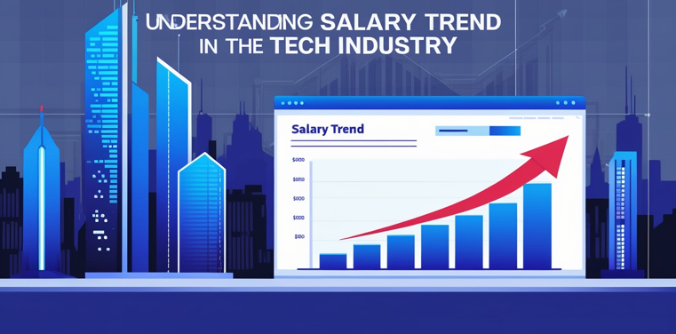
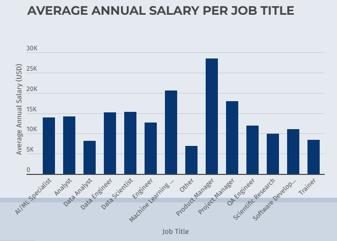
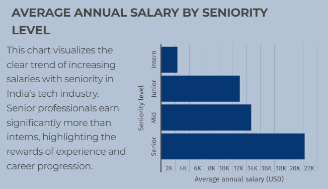

# Understanding Salary Trend in the Tech Industry

---

## Project Overview
This project analyzes emerging market salary trends in the tech industry, focusing on job titles and seniority levels. By examining an Indian dataset, we aim to provide valuable insights for career planning and salary negotiations. The data was transformed into a Pivot table using WebDataRocks and visualized with Infogram.

## Tools
- WebDataRocks: This is a tool for creating pivot tables to analyze and visualize data in a web browser.
- Infogram: is an online tool for creating and sharing interactive infographics, reports, and charts easily.
- Infographics: are visual representations of data or information, designed to make complex ideas easier to understand quickly.

## Data Visualization
You can interact with the report [here](https://infogram.com/understanding-salary-trend-in-the-tech-industry-1hxj48m3dnxe52v?live)

## Conclusion
Our analysis of Indian tech industry salary trends reveals Product Managers earning the highest, likely due to their strategic skillset and management responsibilities. Salaries tend to increase with seniority, highlighting the financial benefits of career advancement. To maximize their earning potential, professionals can explore upskilling opportunities, consider roles with higher earning potential aligned with their skills and interests, and confidently negotiate their salaries based on their experience and value.
